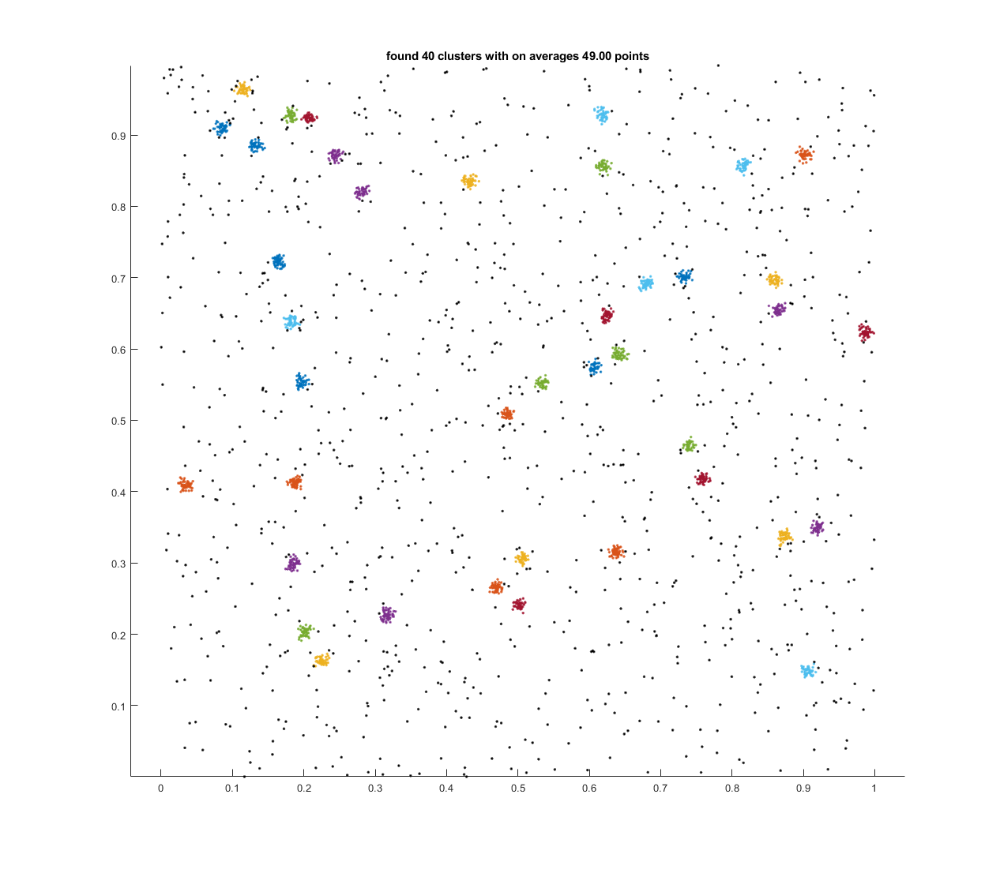

# DBSCAN for Matlab
Based on the original paper: Ester, Martin, et al. "A density-based algorithm for discovering clusters in large spatial databases with noise." Kdd. Vol. 96. No. 34. 1996.

Instead of the suggested R*-tree it uses the matlab implementation of kd-trees by Andrea Tagliasacchi. It can be found here: https://github.com/ataiya/kdtree/

Example created with fdbscan_example.m. For this example with 30.000 points dbscan takes 0.5 seconds on a intel Xeon E3-1245.

